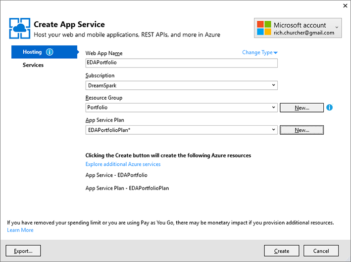
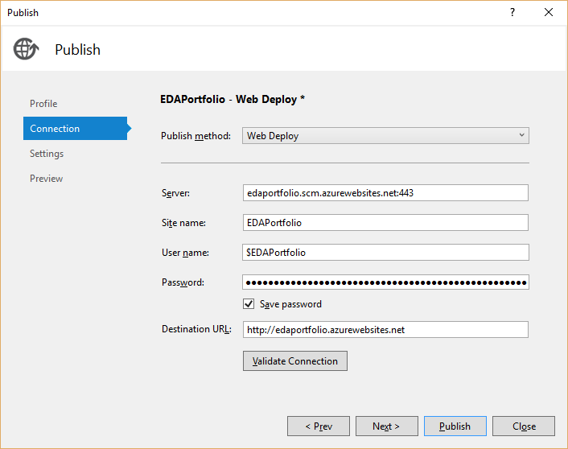
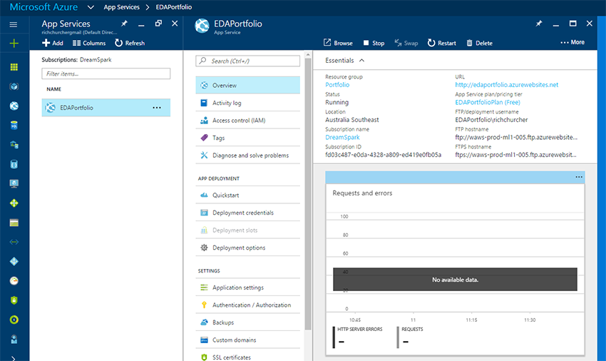
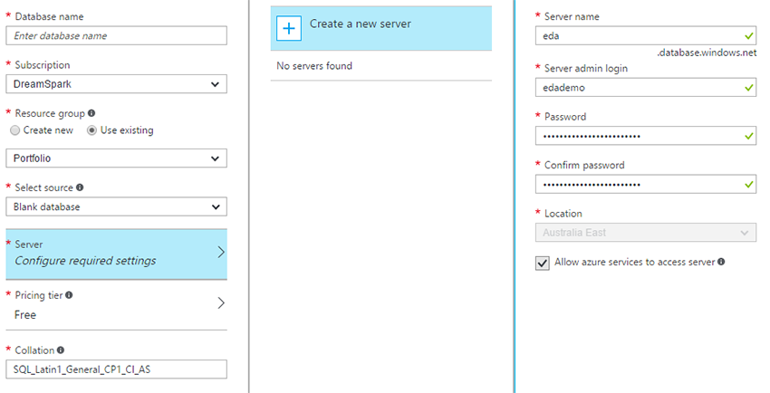
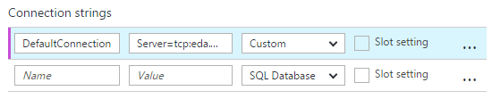
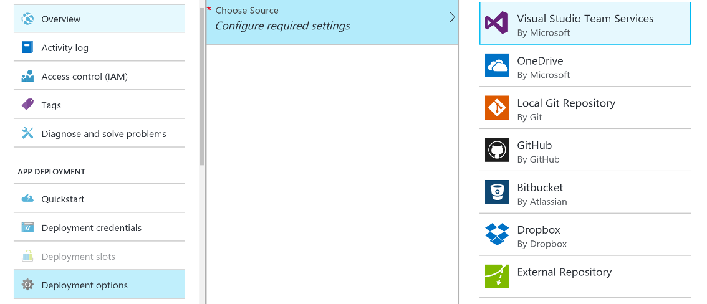

# Deployment

Let's try to get this thing world-visible. Right click on the `Portfolio` project and choose _Publish..._, then choose _Microsoft Azure App Service_. You'll see a dialog like this one:



Note that you won't see "DreamSpark" as the subscription plan (that's something that doesn't really exist anymore, they rebranded it as "Microsoft Imagine") but they do have a similar free tier and if you've already signed up for Visual Studio Dev Essentials previously in Phase 4 to get the Pluralsight subscription, you will also have gotten some free Azure credits.

It's worth noting that you should be very careful not to accidentally get charged for using Azure! It is possible to do this entire module without paying any money. You should always be working from a free tier/free credits plan.

You will probably need to create a new resource group and app service plan. Choose locations close to you (Southeast Australia, for example). When you submit these details, you'll see a dialog like this one:



Obviously, you won't be able to call yours `edaportfolio` because we've already stolen that URL! At this point, you can click _Publish_ and you'll soon be looking at the 'finished' product.


## SQLServer

But wait, there's more! Unfortunately your newly-published site is not quite functional yet. Although you might be able to browse around, anything database-related will fail. Unsurprisingly, we can't just use our local database on Azure: we need to do some more configuration first.

> Note: you can add SQL databases from the Create App Service dialog in Visual Studio which you saw above, by clicking on _Services_ (see [this](https://azure.microsoft.com/en-us/documentation/articles/web-sites-dotnet-deploy-aspnet-mvc-app-membership-oauth-sql-database/) tutorial for more). However, it's good to get familiar with the web portal interface as well.

In your browser, visit [the Azure Portal](https://portal.azure.com) and sign in with your Microsoft account. Click on _App Services_, then the name of your portfolio application. You'll be presented with an awful lot of information about the app... take some time to explore, but probably don't change anything just yet. Click through the various options to get a feel for what's possible.



Now go all the way back to the left hand side and click on _SQL Databases_, then _Add_. Give the database a name, and be sure it's using a free subscription (or one with free credits). Click the _Use existing_ radio button, and choose the resource group you created earlier (possibly called "Portfolio"). _Select source_ should be "Blank database". Under server, you'll need to create a new one:



Note that the server could end up being used by more than one application, so you don't necessarily need to name it 'portfolio'. Be sure to remember the username and password: you'll need them later.

Click _Create_ down the bottom when you're done. Azure will work away in the background creating the database server. When it's done (try hitting _Refresh_) you'll see your database on the list.

Click on the database, then _Overview_, then _Show database connection strings_. When they've loaded, click the copy icon next to _ADO.NET (SQL authentication)_. Then go back to _App Services_, click on your application, then _App Settings_. There's an entry for connection strings: create a new one called `DefaultConnection` and paste the copied connection string into the second box.  It's important that we call it `DefaultConnection`, because that's the name of the connection in our development version of the application. When we deploy, that connection will be overridden by Azure's connection of the same name.
In part of the connection string you'll see this:

```
User ID={your_username};Password={your_password};
```

Replace these sections with your SQLServer user and pass, so they'll end up looking like this:

```
User ID=edademo;Password=12345ABCDE;
```

Be sure to click _Save_ at the top of the page: the button isn't always obvious!





## Deploy with GitHub

Finally, let's set up some continuous deployment for extra bonus points. What we want to happen: whenever we push the master branch to GitHub, it triggers an update of our deployed site. This is a pretty common deployment scenario, and one of the reasons why little or no development normally happens on master!

In the portal, go to the portfolio application and select _Deployment options_, then _Configure required settings_:



Select GitHub, then _Configure required settings_, then click the _Authorize_ button which will take you to GitHub. Grant access to whatever Azure needs (usually the organisation in which your repo is kept, or just your personal repos). You'll see some options asking you to configure which organisation, project, and branch you'd like to deploy from. Make the appropriate selections and click _Ok_. (You don't have to configure _Performance test_.)

The tricky part here is that we're keeping all of our auth secrets in a file that isn't committed to source control. How inconvenient! However, don't give in to the temptation to quietly add all that secret information to your repo... it's really a bad idea. Instead, we can add settings under _Application settings_ that will do the same job, just like we did with the database connection string.

Now you should be good to go! Want to see it in action? Make a trivial but obvious change to your project (alter a heading, for example). Save and commit to master, then push master to GitHub.
