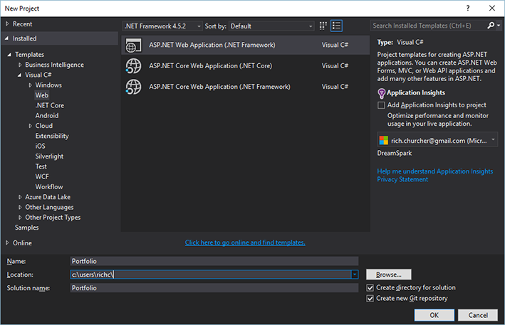
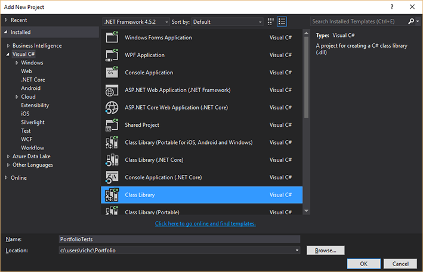
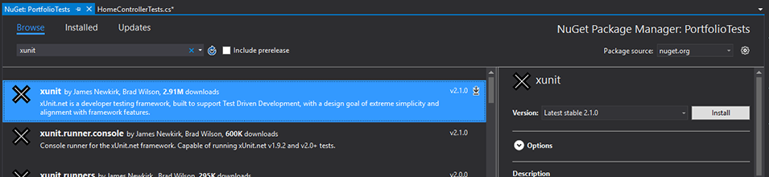
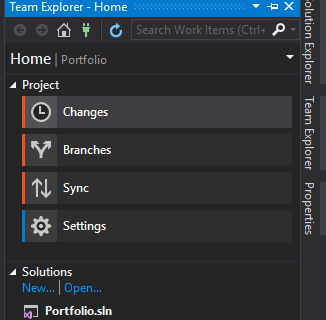
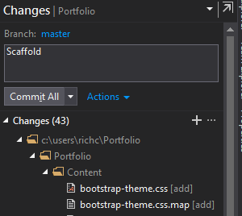

# Scaffolding your new portfolio

So let's make a portfolio site. The site should collect your various projects and work history in one easy to update location. You could also choose to do something different, with very much the same structure... examples include a photo album, collection of links, simple blog engine, and so on.

## First steps

Visual Studio takes care of quite a bit of this for you. Start a new project with _File_ / _New_ / _Project_ (or Ctrl-Shift-N).



Notice several things here:

 - In the left-hand column, _Web_ is highlighted under _C#_.
 - .NET Framework 4.5.2 is selected in the dropdown at the top.
 - The ASP.NET Web Application template is selected. You don't want anything that says .NET Core, at least not for now.
 - The Application Insights checkbox is deselected on the right hand side. Until you know what these are, you don't need 'em.
 - A name has been provided. Pay attention to where Visual Studio plans to save your solution: by default, it'll be in the projects directory but you may prefer a work directory elsewhere.
 - The boxes for _Create directory for solution_ and _Create new Git repository_ are both checked: you want these.

When you click OK, you'll be taken to a screen like this one:


Things to look out for:

 - Make sure MVC is selected, as shown above
 - Authentication (on the right) should say _Individual User Accounts_.
   - This will take care of quite a bit of automatic scaffolding for you, including the database. You'll want this option most of the time, and you can easily add third-party authentication later (Facebook, Google etc.)
 - You could, if you wished, set up Azure deployment at this step but leave it unchecked for now.
   - We'll go over deployment later in the week.
 - Although it offers to make a test project for you, you can leave this unchecked for now.
   - It'll set it up using Microsoft's test suite, and we're going with xUnit. We can avoid adding a bunch of things we don't need by doing it ourselves.

Clicking OK at this point will set off a lot of downloading and installing, much like a big NPM install! You'll end up looking at the `Project_Readme.html`, which is a standard file featuring links to various things you can do with ASP.NET. You can safely close this for now.


## Updating packages

It's a good idea to update to the latest stable versions of the packages in your solution. In Solution Explorer, right click on the `Portfolio` solution and choose _Manage NuGet Packages for Solution..._. Click _Update_, and wait for the available updates to finish loading. Check the _Select all packages_ box near the top left, and click _Update_.

This will take quite awhile: good get-up-and-stretch moment!


## The test project

We're going to need some unit tests. In the Solution Explorer, right click the Portfolio solution and choose _Add_ / _New Project..._. The Web Application project template will probably still be selected, but don't choose this: you want to click on _C#_ on the left hand side, and you'll see a whole lot of different options. Find _Class Library_ and click once on that, then enter the name _PortfolioTests_.



 - Notice there's several templates starting with _Class Library_: choose the plain one.

In the Solution Explorer, right click the file that was automatically created in `PortfolioTests` called `Class1` and rename it to `HomeControllerTests`. Replace the content with the following:

```cs
using System.Web.Mvc;
using SimpleDemo.Controllers;
using Xunit;

namespace PortfolioTests
{
    public class HomeControllerTests
    {
        [Fact]
        public void Index()
        {
            // Arrange
            var controller = new HomeController();

            // Act
            var result = controller.Index() as ViewResult;

            // Assert
            Assert.NotNull(result);
        }
    }
}
```

There's going to be a bunch of red now! That's because we need to install a few more things and add some references. In Solution Explorer, right click on `PortfolioTests` and select _Manage NuGet Packages..._. Click _Browse_, then search for 'xunit':



Install both xUnit and the xUnit Visual Studio runner (you don't need the console runner just now). Once that's done, search on 'mvc' and install Microsoft.AspNet.Mvc, then close the Package Manager window. In Solution Explorer, right click on `PortfolioTests` and choose _Add_ / _Reference_. The first thing you should see is an empty checkbox for `Portfolio`: check that box. 

That should be enough to get rid of the 'red squigglies'. Run the tests just to be sure your scaffold is working (open the test runner with _Test_ / _Windows_ / _Test Explorer_ if it's not already open). 


## Stage and commit

Create a repository on your GitHub account. You can of course add and commit the solution using command line Git tools, but you might like to try using the Team Explorer. Open it using _View_ / _Team Explorer_, click the little home icon, then _Changes_.



Enter a commit message, then hit the _Commit All_ button (if it asks you to save changes to the solution file, do that).



It'll offer a link to _Sync_ your repository. This is the same as a `git push`. Click the link and the _Publish Git Repo_ that will be displayed, enter the URL for your GitHub repository, and click the _Publish_ button.

If you have difficulty with any of this setup stuff, ask in the Phase 4 Slack channel for help.
