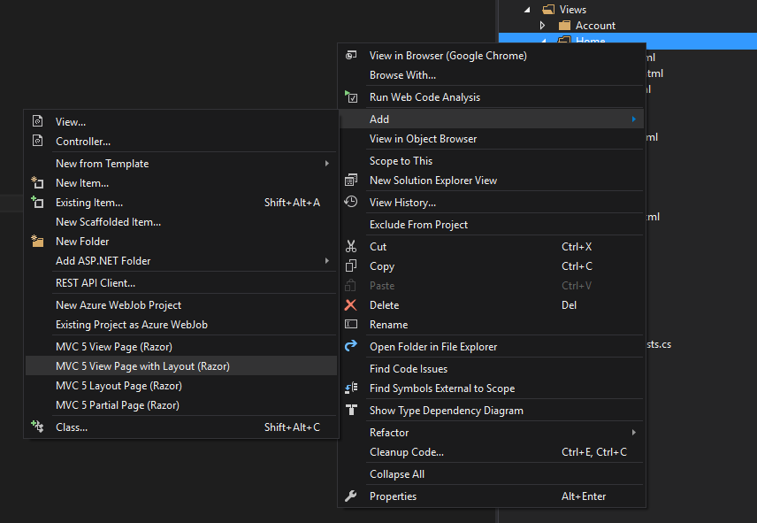
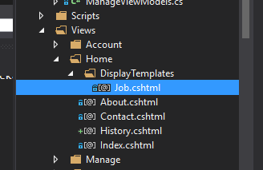

# The 'Work History' page

One of the features we'd like to present in the online portfolio is a chronological summary of your work history. Think about what you see when you visit LinkedIn's summary of experience: that kind of display, only hopefully more engaging!


## View model

Let's start with the data first. Before we do the user-facing pretty stuff, we need to think about what kind of information we're going to need to build the view:

 - A page title
 - A list of jobs. Each job should have:
   - start date
   - finish date
   - title
   - description

There are probably other things we might be able to use, but we'll add them as we go. Thinking about what data we might need before doing the cosmetic part of the page helps us think about how the rest of the application will need to be organised. This is a good practice to apply no matter what tech stack you're working with.

Start from the inside-out! Create a new class under _Models_ in Solution Explorer called `Job.cs`. It should just consist of public properties like so:

```cs
using System;

namespace Portfolio.Models
{
    public class Job
    {
        public int Id { get; set; }
        public DateTime Start { get; set; }
        public DateTime Finish { get; set; }
        public string Title { get; set; }
        public string Description { get; set; }
        public DateTime Created { get; set; }
        public DateTime Updated { get; set; }
    }
}
```

Now create a new class under _Models_ `HistoryViewModel.cs`. For now, it should just have a collection of `Job` in it (later there will no doubt be other things to add):

```cs
using System.Collections.Generic;

namespace Portfolio.Models
{
    public class HistoryViewModel
    {
        public string Title { get; set; }
        public ICollection<Job> Jobs { get; set; }
    }
}
```

 - We don't really need all the properties associated with a database record here, like `Id` or `Created`/`Updated`: this model will never be stored in the database, it's strictly for the _view_
 - We use a generic collection which can be converted to something more specific later as required


## Testing the view model

We can write unit tests for our view model because it's returned to us in the `Model` property of the `ViewResult`:

```cs
using System.Web.Mvc;
using Portfolio.Controllers;
using Portfolio.Models;
using Xunit;

namespace PortfolioTests
{
    public class HistoryTests
    {
        [Fact]
        public void HistoryReceivesViewModel()
        {
            // Arrange
            var controller = new HomeController();

            // Act
            var result = controller.History() as ViewResult;
            var model = result?.Model as HistoryViewModel;

            // Assert
            Assert.NotNull(result);
        }
    }
}
```
 - Notice the `?.Model`? That's a [null reference check](https://msdn.microsoft.com/en-us/library/dn986595.aspx).
 
`History` will be red because it doesn't exist yet. We have to create it in `HomeController` like so:

```cs
public ActionResult History()
{
    var vm = new HistoryViewModel();
    return View(vm);
}
```

This, in turn, will complain that the view does not exist. Better create it! Right click _Views_ / _Home_ and choose _Add_ / _MVC 5 View Page with Layout (Razor)_:



Call it `History`, and when it asks you to choose a layout page, select `_Layout.cshtml`. This will create a blank view with a predefined layout (the title bar, menu etc). Write some simple text in the view so you can see it working right away:

```cs
@{
    Layout = "~/Views/Shared/_Layout.cshtml";
}

Hey, it's a work history page!
```

Then run your tests. Hit F5 to launch the site in the debugger and visit `/Home/History` to see it in the browser.


## Populating the view model

Sending an empty view model to the view seems a bit silly. Create a few `Job`s to put in your history, and add them to the `HistoryViewModel` before sending it to the view. Normally this data would come from the database, but we're just mocking up data for now so that we can work with it. You can use initialiser syntax, so your code might follow this pattern:

```cs
var vm = new HistoryViewModel
{
    Title = "Work History",
    Jobs = new List<Job>
    {
        new Job
        {
            Start = DateTime.Now.AddDays(-7),
            Finish = DateTime.Now,
            Title = "Wombat Wrangler",
            Description = "Wrangled many wombats."
        },
        new Job
        {
            Start = DateTime.Now.AddDays(-14),
            Finish = DateTime.Now.AddDays(-7),
            Title = "Aardvark Auditor",
            Description = "Audited many aardvarks."
        },
        new Job
        {
            Start = DateTime.Now.AddDays(-30),
            Finish = DateTime.Now.AddDays(-14),
            Title = "Kinkajou Keeper",
            Description = "Kept many kinkajou (and then set them free)."
        }
    }
};
```

## Using the data

Now that we have some data to work with, we can start to display it in the view. Most of the view is just HTML, but because it's also a Razor template we can handle data passed from the controller in the view model. First, we need to tell the view that it's [_strongly-typed_](http://www.asp.net/mvc/overview/views/dynamic-v-strongly-typed-views): it will be expecting our `HistoryViewModel`. Add the following line to the top of `History.cshtml`:

```cs
@model Portfolio.Models.HistoryViewModel
```

Now when you type a value from the model in your view, intellisense will kick in and show you a list of the model's properties to choose from. You should also be able to modify the view and see the effects without restarting the debugger. Try it!

```cs
<h1>@Model.Title</h1>
```

 - Note that when we refer to the model in the body of the view, we use a capital `M`

To loop through the jobs in our view model, we can use `@foreach`:

```cs
@foreach (var job in Model.Jobs)
{
    <p><strong>@job.Title</strong></p>
    <p>@job.Description</p>
}
```

 - Notice that `Model` isn't preceeded by an `@` symbol. This is because we're already inside a C# expression. Razor uses the `@` at the start of the line to determine that the following text is C#
 - The text inside the braces is HTML, so requires an `@` in front of the model values to tell the templating engine that they come from C#

This approach works fine. However, it's not considered 'best practice'! In general, we want to keep as much code as possible _out_ of the view. 

A way around this is to tell the view exactly how you want to display a `Job`. To do this we use a _partial_, which are based around a similar concept to Handlebar's partials, but can be associated with a model. Add a new folder under `Views/Home` called `DisplayTemplates`. Right click this and choose _Add_ / _MVC 5 Partial Page (Razor)_. Note that it will try to name it with a leading underscore, but you actually want to call it `Job.cshtml` so that the HTML helper will know which one to use. 



Inside, put this:

```cs
@model Portfolio.Models.Job

<p><strong>@Model.Title</strong></p>
<p>@Model.Description</p>
```

 - The capital `M` in `@Model.Title` is important!

Obviously, you could modify this to your heart's content to make the job list look however you wish. Finally, replace your `@foreach` block in the `History` view with this one statement:

```cs
@Html.DisplayFor(m => m.Jobs)
```

This pattern (teaching the view how to display your model) is a good structure to follow for the rest of the development of your site. We won't go into such detail again, but will mention "construct a display template for your model" etc.


## Resources

 - [The Ultimate Guide To Unit Testing in ASP.NET MVC](http://www.danylkoweb.com/Blog/the-ultimate-guide-to-unit-testing-in-aspnet-mvc-E2) - the writing's not especially strong, but some of the examples are useful. Note that he does not use xUnit, so you might need to modify some of them a little.
 - [Working With Built-In HTML Helper Classes in ASP.NET MVC](http://www.c-sharpcorner.com/article/working-with-built-in-html-helper-classes-in-Asp-Net-mvc/)
